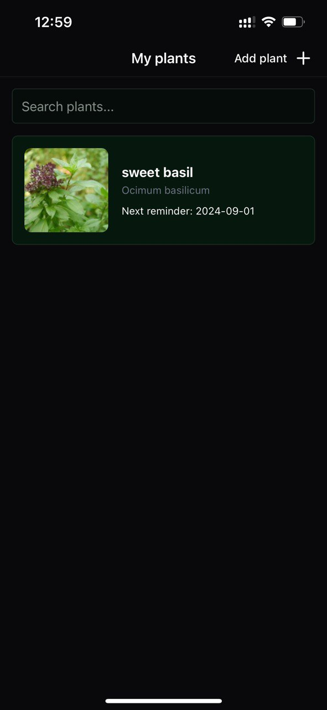
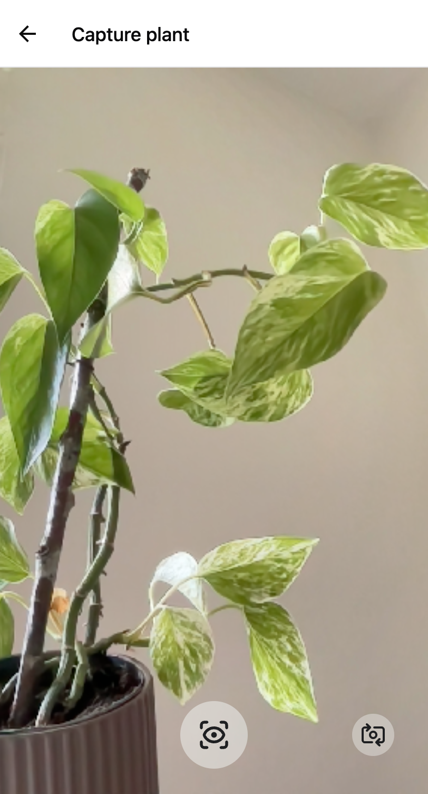
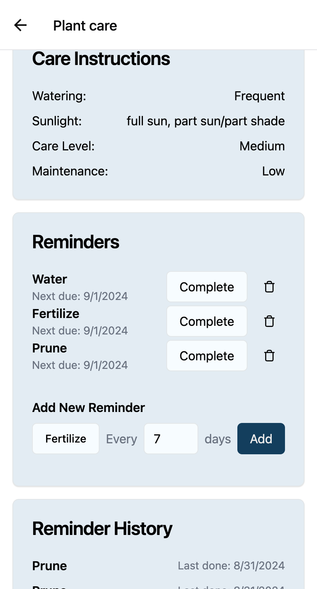
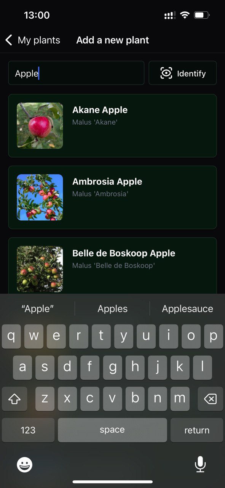
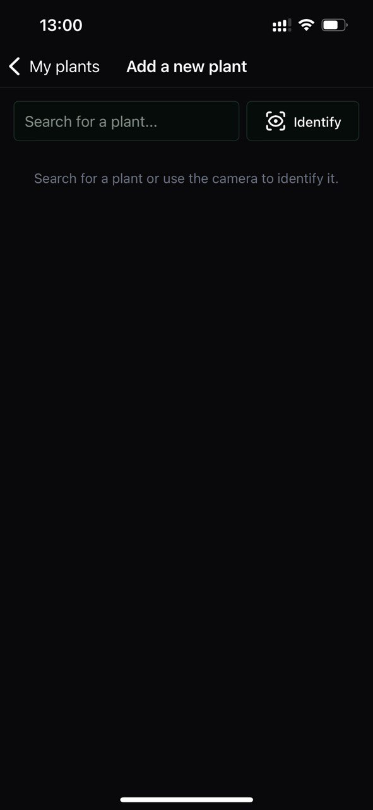

# Nurture: Plant Detection and Care App

**Nurture** is your personal plant care assistant, helping you identify, track, and care for your plants with ease.

## Features

- **Plant Identification**: Snap a photo and let Nurture identify your plant.
  
  

- **Personalized Care Reminders**: Set custom reminders for watering, fertilizing, and more.

  

- **Comprehensive Plant Database**: Access detailed care instructions for a wide variety of plants.

  

- **Plant Collection Management**: Keep track of all your plants in one place.

  

- **Search Functionality**: Easily find plants by name or characteristics.

  

- **Care History Tracking**: Log and view your plant care activities over time.

- **Push Notifications**: Receive timely reminders for plant care tasks.

- **Cross-Platform Compatibility**: Available on both iOS and Android (untested) devices. (Also works on the web with React Native Web!)

## Technology Stack

- Frontend: [React Native](https://reactnative.dev/) with [Expo](https://expo.dev)
- Backend: [Hono](https://hono.dev/)
- Database: [MongoDB Atlas](https://www.mongodb.com/atlas)
- Authentication: [Clerk](https://clerk.com/)
- Plant Identification: [PlantNet API](https://plantnet.org/)
- Plant Data: [Perenual API](https://perenual.com/docs/api)

---

Happy Planting! 🌱